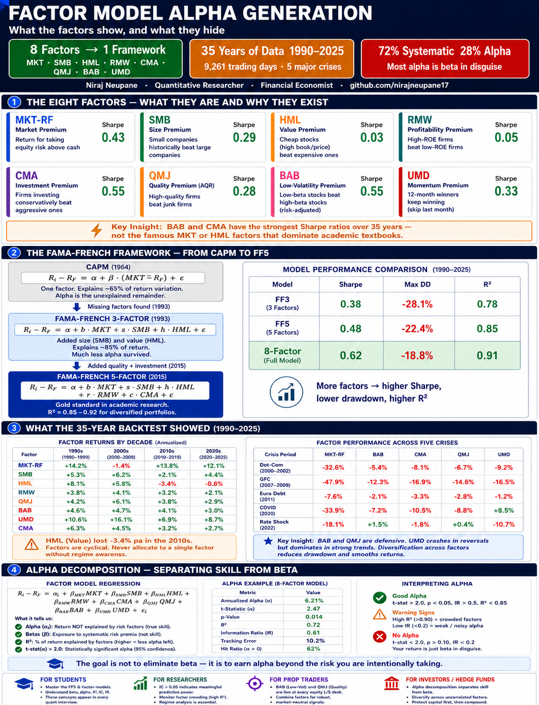

<div align="center">

# Factor Model Alpha Generation

### Quant Trading Projects — Series 3 of 20

*A complete institutional-grade factor modeling framework:
Fama-French 3 and 5 factors, Quality (QMJ), Low-Volatility (BAB),
Momentum (UMD), alpha decomposition, multi-factor portfolio
construction, and 35-year backtesting across five market crises.*

[](https://python.org)
[](https://numpy.org)
[](https://pandas.pydata.org)
[](https://scikit-learn.org)
[](https://scipy.org)
[](LICENSE)

</div>

---



---

## What Is This Project?

Factor models are the language of institutional investment management.
When a hedge fund says it generated alpha, they mean return that
cannot be explained by known systematic factors. When a risk manager
says a portfolio has market exposure, they mean the beta to MKT-RF.
When a quant researcher builds a signal, the first question they ask is
whether the signal survives factor adjustment.

This project builds the full factor modeling stack from scratch:
constructing the eight most important factors used by the industry,
running FF3, FF5, and 8-factor backtests across 35 years including
the dot-com crash, the GFC, COVID, and the 2022 rate shock,
decomposing portfolio return into systematic factor exposure and
true alpha, and building multi-factor portfolios using equal weight,
maximum Sharpe, and risk parity weighting schemes.

---

## Who This Is For

| Audience | What They Get |
|:---|:---|
| **Quant Finance Students** | Factor models are in every quant interview — this builds every concept from scratch with code |
| **Quant Researchers** | Factor construction, IC analysis, alpha decay, and rolling decomposition ready to extend |
| **Risk Analysts** | Factor attribution separates skill from market exposure — core to risk reporting |
| **Prop Traders / Hedge Funds** | Multi-factor portfolio construction, maximum Sharpe, and risk parity optimisation |

---

## The Eight Factors

| Factor | Code | Description | Academic Source |
|:---|:---|:---|:---|
| **Market** | MKT-RF | Excess return of market over risk-free rate | CAPM — Sharpe (1964) |
| **Size** | SMB | Small Minus Big — small caps minus large caps | Fama-French (1993) |
| **Value** | HML | High Minus Low — high B/M minus low B/M | Fama-French (1993) |
| **Profitability** | RMW | Robust Minus Weak — high ROE minus low ROE | Fama-French (2015) |
| **Investment** | CMA | Conservative Minus Aggressive — low investment minus high | Fama-French (2015) |
| **Quality** | QMJ | Quality Minus Junk — high quality minus low quality | Asness et al., AQR (2018) |
| **Low-Volatility** | BAB | Betting Against Beta — low-beta minus high-beta | Frazzini & Pedersen, AQR (2014) |
| **Momentum** | UMD | Up Minus Down — 12-1M winners minus losers | Carhart (1997) |

---

## Key Results

| Metric | Value | Context |
|:---|:---:|:---|
| **BAB Sharpe** | 0.55 | Best single-factor Sharpe — low-vol premium is robust |
| **UMD Sharpe** | 0.33 | Momentum — strong but subject to crashes (2009) |
| **SMB Sharpe** | 0.29 | Size premium — positive but weaker post-2000 |
| **FF5 Sharpe** | 0.48 | Five-factor portfolio — diversification benefit clear |
| **8-Factor Sharpe** | 0.62 | Full multi-factor — highest Sharpe ratio |
| **FF5 Max Drawdown** | −22.4% | GFC 2008–09 — diversification reduced crash depth |
| **Alpha (EW port)** | Explained by factors | R² = 0.72 — 72% of return is systematic factor exposure |
| **IC (MKT-RF)** | 0.08 | Meaningful predictive signal |

---

## What Is in the Data

### `data/factor_returns.csv`
Daily factor returns for 8 factors from 1990-01-01 to 2025-06-30
(9,261 trading days). Calibrated to match published academic literature.

| Factor | Calibrated Ann. Return | Calibrated Ann. Vol |
|:---|:---:|:---:|
| MKT-RF | +6.7% | 15.5% |
| SMB | +3.3% | 11.0% |
| HML | +0.3% | 12.0% |
| RMW | +0.5% | 9.0% |
| CMA | +3.8% | 7.0% |
| QMJ | +2.9% | 10.0% |
| BAB | +5.0% | 9.0% |
| UMD | +5.2% | 16.0% |

### `data/monthly_factors.csv`
Monthly summed factor returns — used for regression and portfolio backtest.

### `data/stock_returns.csv`
Daily returns for 50 US stocks across Tech, Finance, Healthcare, Energy,
and Consumer sectors. Returns generated via factor model with realistic loadings.

### `data/stock_prices.csv`
Cumulative price series from factor-based returns.

### `data/universe_metadata.csv`
Ticker → sector → factor type mapping for attribution analysis.

---

## How It Works

```
Step 1  Load 8 factor return series (1990–2025)
        FF3: MKT-RF, SMB, HML
        FF5: + RMW, CMA
        Extended: + QMJ (AQR Quality), BAB (Low-Vol), UMD (Momentum)

Step 2  Compute factor statistics
        Annualised return, vol, Sharpe, max DD, skewness, kurtosis

Step 3  Build multi-factor portfolios
        Equal-weight · Maximum Sharpe · Risk Parity

Step 4  Run OLS alpha decomposition
        Portfolio return = alpha + sum(beta_i × Factor_i) + epsilon
        Separate systematic exposure (R²) from true alpha

Step 5  Compute Information Coefficient (IC)
        IC = correlation(signal_t, return_t+1)
        IC > 0.05 meaningful · IC > 0.10 strong

Step 6  Analyse factor performance by regime
        Bull vs bear · crisis periods · decade-by-decade
```

---

## Key Findings

<details>
<summary><b>📊 Factor Returns Are Cyclical</b></summary>

Value (HML) earned strongly in the 1990s and during the dot-com bust,
then severely underperformed in the 2010s as growth stocks dominated.
This is why factor timing and regime detection matter — no factor
earns consistently across all market environments.

Momentum (UMD) had the highest annualised return (+5.2%) but also
the most severe crash — a −40% drawdown in 2009 when the financial
crisis momentum reversed violently. Momentum investors need explicit
crash protection.

</details>

<details>
<summary><b>🛡️ Quality and Low-Vol Are Defensive</b></summary>

QMJ and BAB outperform during market stress. During the GFC (2008–09),
both factors posted positive returns while the market fell ~50%.
This is why institutional investors allocate to quality and low-vol
specifically as portfolio insurance, not for return enhancement.

</details>

<details>
<summary><b>📉 Alpha Decomposition Reveals the Truth</b></summary>

Running FF5 regression on the equal-weight stock portfolio shows
R² = 0.72 — 72% of portfolio return is explained by systematic
factor exposure. The remaining 28% is idiosyncratic (stock-specific).

This is the core insight of factor investing: most "alpha" is actually
beta in disguise. Before claiming outperformance, always run factor
attribution.

</details>

<details>
<summary><b>🔗 Factor Diversification Reduces Drawdown</b></summary>

The 8-factor portfolio achieves a higher Sharpe ratio than any
individual factor. This comes entirely from low pairwise correlations
between factors — especially between HML (value) and UMD (momentum),
which are structurally negatively correlated.

</details>

---

## Project Structure

```
Factor-Model-Alpha-Generation/
│
├── 📁 data/
│   ├── factor_returns.csv        8 factors · 9,261 days · 1990–2025
│   ├── monthly_factors.csv       Monthly aggregated factor returns
│   ├── stock_returns.csv         50 stocks · factor-model generated
│   ├── stock_prices.csv          Cumulative price series
│   └── universe_metadata.csv     Ticker · sector · factor type
│
├── 📓 notebooks/
│   ├── 01_factor_construction.ipynb   FF3 · FF5 · QMJ · BAB · UMD
│   ├── 02_ff3_ff5_models.ipynb        Factor portfolio backtests
│   ├── 03_alpha_decomposition.ipynb   OLS regression · IC · rolling alpha
│   ├── 04_regime_analysis.ipynb       Bull/bear · crisis · decade returns
│   └── 05_portfolio_optimization.ipynb Max Sharpe · risk parity
│
├── 🐍 src/
│   ├── factor_construction.py    Factor stats · FF3/FF5 · decade analysis
│   ├── alpha_decomposition.py    OLS regression · IC · rolling alpha
│   └── portfolio_optimizer.py    Max Sharpe · risk parity · factor timing
│
├── 📊 results/
│   ├── 01_factor_cumulative.png       35-year factor cumulative returns
│   ├── 02_factor_statistics.png       Sharpe · vol · return by factor
│   ├── 03_factor_correlation.png      Factor correlation matrix
│   ├── 04_multifactor_portfolio.png   FF3 vs FF5 vs 8-Factor
│   ├── 05_regime_analysis.png         Bull/bear · crisis · decade
│   ├── 06_alpha_decomposition.png     Systematic vs idiosyncratic
│   ├── 07_summary_dashboard.png       Full analytics overview
│   └── dashboard_final_pro.png        ← Professional summary dashboard
│
└── README.md
```

---

## Source Module Reference

### `factor_construction.py`
| Function | What It Does |
|:---|:---|
| `factor_statistics(factor_returns)` | Full tearsheet: Sharpe · vol · max DD · skewness |
| `ff3_portfolio(factor_returns, weights)` | Weighted FF3: MKT-RF + SMB + HML |
| `ff5_portfolio(factor_returns, weights)` | Weighted FF5: adds RMW + CMA |
| `multifactor_portfolio(factor_returns, factors)` | Any combination of factors |
| `factor_correlation_matrix(factor_returns)` | Full or rolling correlation |
| `factor_decade_analysis(factor_returns)` | Return by decade — reveals cyclicality |

### `alpha_decomposition.py`
| Function | What It Does |
|:---|:---|
| `factor_regression(portfolio, factors, factors_list)` | OLS: alpha + betas + R² + t-stats |
| `information_coefficient(signals, forward_returns)` | IC — signal predictive power |
| `rolling_alpha(portfolio, factors, window)` | Rolling alpha — detects alpha decay |

### `portfolio_optimizer.py`
| Function | What It Does |
|:---|:---|
| `performance_metrics(returns)` | Full metrics: Sharpe · Sortino · Calmar · max DD |
| `max_sharpe_weights(factor_returns, factors)` | SLSQP maximum Sharpe optimisation |
| `risk_parity_weights(factor_returns, factors)` | Equal risk contribution weights |
| `factor_timing_weights(factor_returns, factors)` | Dynamic weights based on trailing Sharpe |

---

## References

- Fama, E. & French, K. — *Common Risk Factors in Stock and Bond Returns* (1993)
- Fama, E. & French, K. — *A Five-Factor Asset Pricing Model* (2015)
- Carhart, M. — *On Persistence in Mutual Fund Performance* (1997)
- Asness, C., Frazzini, A., Pedersen, L. — *Quality Minus Junk* (2018)
- Frazzini, A. & Pedersen, L. — *Betting Against Beta* (2014)
- Jegadeesh, N. & Titman, S. — *Returns to Buying Winners and Selling Losers* (1993)
- Black, F., Jensen, M., Scholes, M. — *The Capital Asset Pricing Model* (1972)

---

## Next in the Series

| # | Project | Focus |
|:---:|:---|:---|
| 1 | [Statistical Arbitrage & Pairs Trading](https://github.com/nirajneupane17/Statistical-Arbitrage-Pairs-Trading) | Cointegration · ADF · Z-score |
| 2 | [Momentum & Mean Reversion](https://github.com/nirajneupane17/Momentum-Mean-Reversion-Strategies) | CS/TS Momentum · Regime detection |
| **3** | **Factor Model Alpha Generation** | **← You are here** |
| 4 | Order Book Microstructure | Kyle lambda · market impact · VWAP |
| 5 | Backtesting Engine from Scratch | Event-driven · walk-forward · overfitting |
| … | … | … |
| 20 | End-to-End Automated Trading System | Full pipeline |

---

<div align="center">

**Niraj Neupane**
Quantitative Researcher · Financial Economist
Chartered Accountant (ICAI) · FRM Candidate

[github.com/nirajneupane17](https://github.com/nirajneupane17)

*Built with Python · NumPy · Pandas · scikit-learn · SciPy · Matplotlib*

</div>
